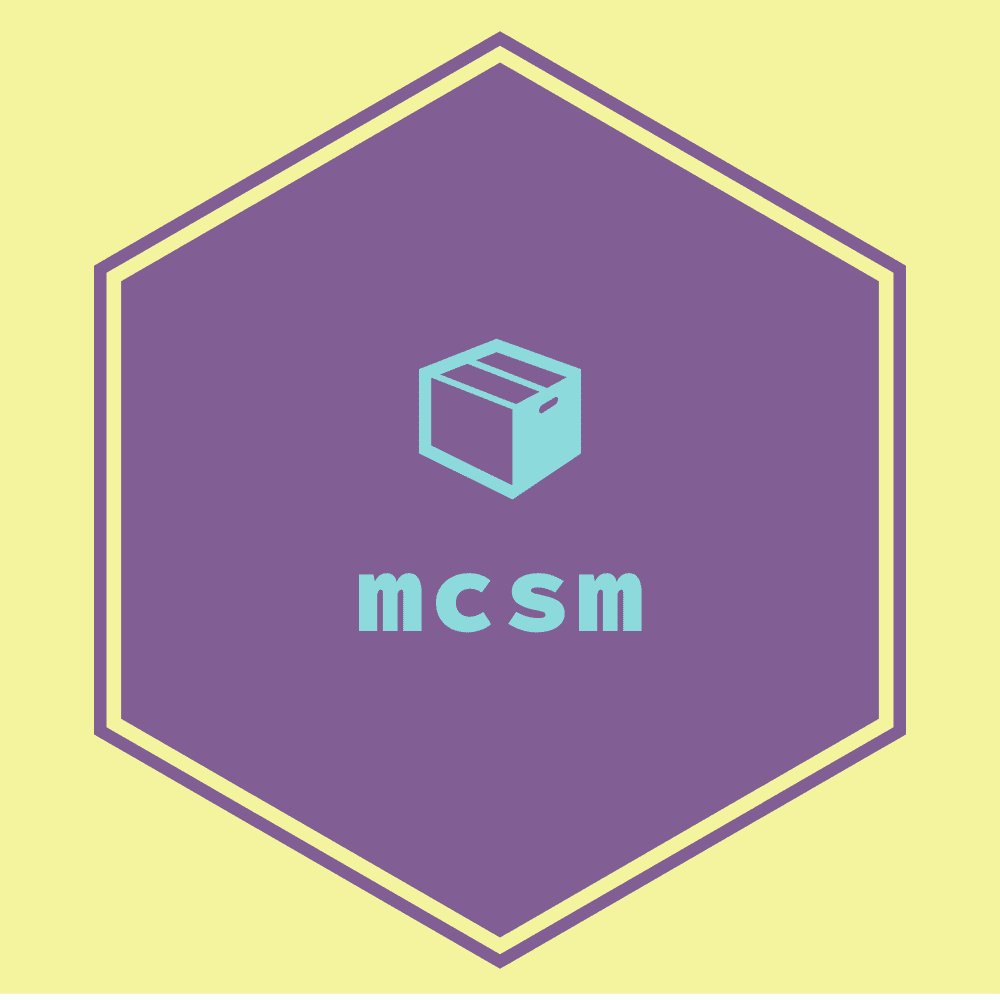

# mcsm - Minecraft Server Manager

:warning: *This project is too early in development to be of any practical use to
anyone* :warning:


_Consolidate Minecraft server operations_



## Features

### Create fresh server installations

```bash
# Install a specific Minecraft server type and version into the local directory
mcsm install server.yaml
```

Installation includes server binaries, plugins, and mods, leaving a ready-to-go
server setup. While convenient for general use in home and private servers, this
is particularly useful for setting up runtime ready, dependency vendored,
environment packaged Minecraft server images for use on platforms like K8s,
Docker Swarm, or even hosted VM platforms.

### Running an installed server

```bash
# Run the local server with all necessary flags and graceful shutdown handling
mcsm run
```

Using `mcsm` to handle running your server removes the hassle of having to
separately handle kill signals or setting up various JVM flags at launch in a
script. `mcsm run` wraps all the usual and necessary flags for various server
types into one command based off your server definition and explicitly handles
OS signals for graceful server termination. This is handy not just for
hand-managed setups, but also simplifies running within containerized
environments or OS service definitions like systemd.

### Consolidated, version-control friendly server declaration

_`vanilla` is currently the only server type supported_

```yaml
# hardcore-server-sample.yaml
# Contains install and runtime specifications in one place
---
install:
  kind: paper # various install types including vanilla, bedrock, and forge
  version: 1.16.4
  plugins:
  # pull copies of plugins from remote sources at install time
  - "https://dev.bukkit.org/projects/clearlagg/files/latest"
  # source local plugins as well
  - "/plugins/world-edit.jar"

run:
  initialmemory: 8G
  maxmemory: 8G

config:
  # override common server settings in one place -- have them ready at run time
  eula:
    accepted: true
  vanilla:
    gamemode: survival
    pvp: true
    hardcore: true
    motd: Hardcore Vanilla Minecraft
    spawn-protection: 4
```

Aside from reducing the mental overhead of remembering how to configure a server
across multiple files, being able to define whole server configuration in a
single file makes for easy collaboration and tracking in SVC repos.
Straight-forward for small server groups and easily templated for general
configuration management solutions.

## Install

_There is currently no pipeline in place, so installation requires cloning and
building locally_

### Pre-Compiled Binaries

CI builds and publishes any new release binaries automatically. To download the
latest version (or even a previous version), visit our [releases
page](https://github.com/loksonarius/mcsm/releases) and download the `mcsm`
package that corresponds to your target system.

To download a specific release from your terminal:

```bash
# download the binary package for the v0.0.1 amd64 release
wget https://github.com/loksonarius/mcsm/releases/download/v0.0.1/mcsm-linux-amd64.tgz

# unpackage downloaded binary
tar -xzf mcsm-linux-amd64.tgz

# move binary to somewhere on my PATH
mv mcsm /usr/local/bin
```

If it's important to have a one-liner to the latest release of a specific
version, consider using the [gitreleases.dev](https://gitreleases.dev) service
instead of linking through GitHub releases:

```bash
# always pull latest release B)
wget https://gitreleases.dev/gh/loksonarius/mcsm/latest/mcsm-linux-mips.tgz

# install as usual
tar -xzf mcsm-linux-mips.tgz && mv mcsm /usr/local/bin
```

### Go

For local system use, run the following from the root of the repo:

```bash
# install CLI built for local system -- requires $GOPATH/bin in $PATH
go install
```

To build binaries for supported Linux systems, use the `just build` task (ref:
[contribution docs](CONTRIBUTING.md)) to run the needed compile steps:

```bash
# compile various Linux binaries
just build

# install a specific one for system-wide use
cp build/mcsm-linux-amd64 /usr/local/bin/mcsm
```

## User Guide

_Wiki pages with common guides comming soon_

## Server Definition Spec

_Soon to be defined and documented in wiki pages_

## Contributing

If you're interested in submitting feature requests, addressing bugs, or
generally understanding how this project works, please visit [our contribution
doc](CONTRIBUTING.md) for info on getting started and helping out. :grin:

[:heart:](https://github.com/loksonarius/mcsm)
